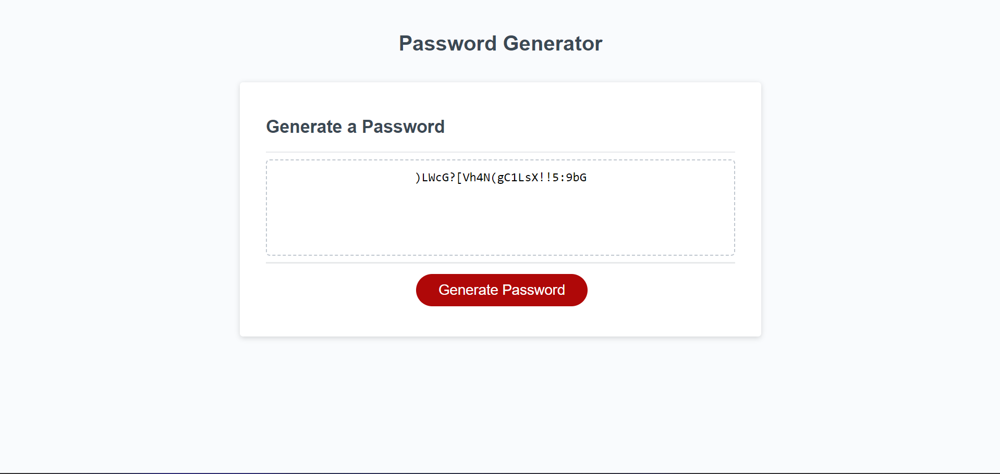

# Password Generator
This repository contains code that creates a random password generator. This generator creates a password depending on the user's selected criteria. Criteria includes: length between 8-128 characters, uppercase letters, lowercase letters, numerical values, and special characters. The generated password is then shown to the user on the webpage. 

# Screenshot

# Link to Deployed App
https://dfussell1.github.io/challenge-three-password-gen/
